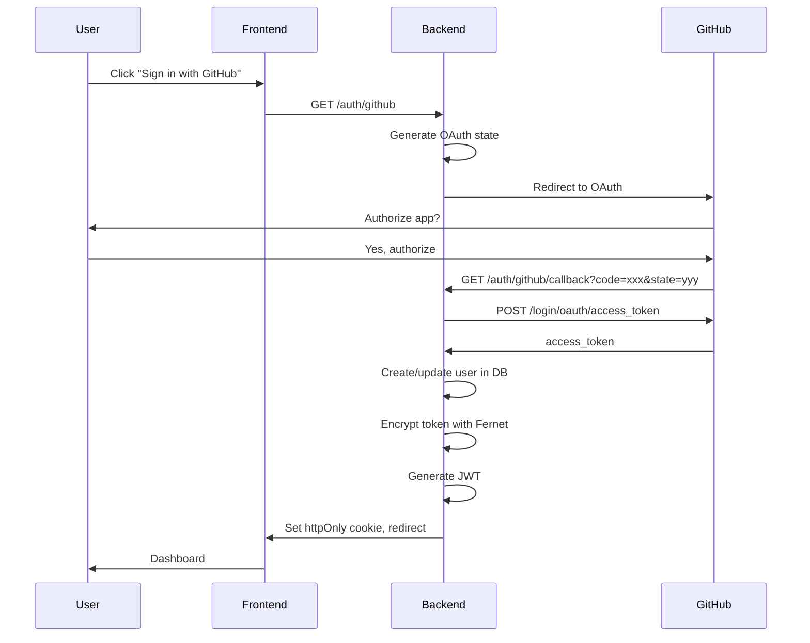
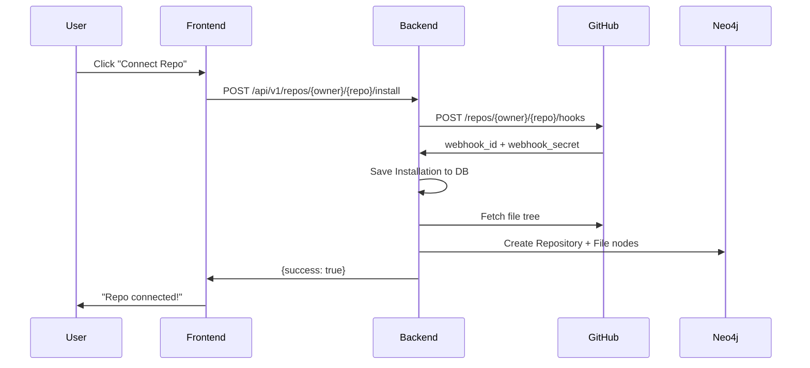

## System Architecture

Nectr is a distributed system with three main components:

1. **Frontend** — Next.js 15 app (Vercel)
2. **Backend** — FastAPI app (Railway)
3. **Databases** — PostgreSQL (Supabase) + Neo4j (Aura)

```
┌───────────────────────────────────────────────────────────────┐
│                       USER / DEVELOPER                               │
└───────────────────────────────────────────────────────────────┘
           │ OAuth                          │ JWT Cookie
           │                                │
           │                                │
┌──────────┴──────────────────────────────────────┴───────────────┐
│                  FRONTEND (Vercel)                            │
│         Next.js 15 + React 19 + TailwindCSS 4               │
│                                                              │
│  /dashboard  /repos  /reviews  /analytics  /team           │
└──────────────────────────────────────────────────────────────┘
           │ REST API (axios, withCredentials)
           │
           ▼
┌──────────────────────────────────────────────────────────────┐
│                BACKEND (Railway)                             │
│           FastAPI + Uvicorn + Python 3.14                   │
│                                                              │
│  ┌────────────────────────────────────────────────────┐  │
│  │                   API ROUTES                          │  │
│  │  /auth/github          GitHub OAuth                   │  │
│  │  /api/v1/webhooks      GitHub webhook receiver         │  │
│  │  /api/v1/repos         Repo management (no redirect)   │  │
│  │  /api/v1/reviews       PR review history               │  │
│  │  /api/v1/analytics     Team metrics                    │  │
│  │  /api/v1/memory        Mem0 CRUD + project map         │  │
│  │  /health               Health check                    │  │
│  │  /mcp/sse              MCP server (SSE transport)      │  │
│  └────────────────────────────────────────────────────┘  │
│                                                              │
│  ┌────────────────────────────────────────────────────┐  │
│  │                SERVICE LAYER                        │  │
│  │  pr_review_service   ─ Review orchestrator          │  │
│  │  ai_service          ─ Claude integration           │  │
│  │  context_service     ─ Mem0 + Neo4j + MCP context  │  │
│  │  graph_builder       ─ Neo4j read/write            │  │
│  │  memory_adapter      ─ Mem0 async wrapper          │  │
│  │  memory_extractor    ─ Post-review extraction      │  │
│  └────────────────────────────────────────────────────┘  │
│                                                              │
│  ┌────────────────────────────────────────────────────┐  │
│  │              INTEGRATIONS                         │  │
│  │  github/client.py       ─ GitHub REST API          │  │
│  │  github/webhook_manager ─ Webhook setup            │  │
│  │  mcp/server.py          ─ FastMCP (outbound)       │  │
│  │  mcp/client.py          ─ MCP client (inbound)     │  │
│  └────────────────────────────────────────────────────┘  │
└──────────────────────────────────────────────────────────────┘
           │          │           │            │
           ▼          ▼           ▼            ▼
┌──────────┐  ┌────────┐  ┌────────┐  ┌───────────┐
│PostgreSQL│  │ Neo4j  │  │  Mem0   │  │ Anthropic │
│(Supabase)│  │  Graph  │  │ Memory │  │   Claude   │
└──────────┘  └────────┘  └────────┘  └───────────┘
```

## Tech Stack

### Frontend

| Component | Technology | Version |
|-----------|------------|--------|
| Framework | Next.js | 15.5.12 |
| UI Library | React | 19.1.0 |
| Styling | TailwindCSS | 4 |
| Data Fetching | TanStack Query | 5.90.21 |
| HTTP Client | Axios | 1.13.6 |
| Charts | Recharts | 3.7.0 |
| Themes | next-themes | 0.4.6 |

**File location**: `nectr-web/`

### Backend

| Component | Technology | Version |
|-----------|------------|--------|
| Framework | FastAPI | 0.129.0 |
| ASGI Server | Uvicorn | 0.41.0 |
| Language | Python | 3.14 |
| ORM | SQLAlchemy | 2.0.46 |
| Migrations | Alembic | 1.18.4 |
| Async Driver | asyncpg | 0.31.0 |
| AI SDK | Anthropic | 0.83.0 |
| Graph Driver | neo4j | 5.0+ |
| Memory | mem0ai | 0.1.98+ |
| MCP | mcp | 1.0.0+ |

**File location**: `app/`

### Databases

| Type | Purpose | Technology |
|------|---------|------------|
| Relational | Users, repos, events, workflows | PostgreSQL (asyncpg) |
| Graph | Files, PRs, developers, relationships | Neo4j (async driver) |
| Semantic | Project patterns, developer habits | Mem0 (cloud API) |

### External Services

| Service | Purpose |
|---------|----------|
| Anthropic Claude | AI PR reviews (Sonnet 4.6) |
| GitHub API | OAuth, webhooks, PR data, comments |
| Mem0 | Semantic memory layer |
| Linear MCP | Linked issues (optional) |
| Sentry MCP | Production errors (optional) |
| Slack MCP | Channel messages (optional) |

## Data Flow

### 1. Authentication Flow



**Key files**:
- Frontend: `nectr-web/src/app/page.tsx`
- Backend: `app/auth/router.py`
- JWT utils: `app/auth/jwt_utils.py`
- Encryption: `app/auth/token_encryption.py`

### 2. PR Review Flow

See [Review Flow](/developers/architecture/review-flow) for detailed diagram.

**Summary**:

1. Developer opens/updates PR on GitHub
2. GitHub sends webhook to `/api/v1/webhooks/github`
3. Backend verifies HMAC signature, creates Event, returns 200
4. BackgroundTask processes PR:
   - Fetch diff and files from GitHub
   - Build context (Neo4j + Mem0 + MCP)
   - Run AI analysis (Claude with agentic tools)
   - Post review comment on GitHub
   - Index PR in Neo4j
   - Extract memories to Mem0

**Key files**:
- Webhook: `app/api/v1/webhooks.py`
- Orchestrator: `app/services/pr_review_service.py`
- AI: `app/services/ai_service.py`
- Context: `app/services/context_service.py`

### 3. Repo Connection Flow



**Key files**:
- Frontend: `nectr-web/src/hooks/useRepos.ts`
- Backend: `app/api/v1/repos.py`
- Webhook manager: `app/integrations/github/webhook_manager.py`
- Graph builder: `app/services/graph_builder.py`

## Security Architecture

### Authentication

1. **GitHub OAuth** — User signs in with GitHub
2. **JWT tokens** — Signed with `SECRET_KEY` (HS256)
3. **httpOnly cookies** — Prevents XSS attacks
4. **SameSite=None; Secure** — Cross-origin support (frontend on Vercel, backend on Railway)

### Token Encryption

GitHub access tokens are encrypted at rest using **Fernet** (AES-128-CBC):

```python
from cryptography.fernet import Fernet
import base64
import hashlib

# Derive Fernet key from SECRET_KEY
key = base64.urlsafe_b64encode(hashlib.sha256(SECRET_KEY.encode()).digest())
fernet = Fernet(key)

# Encrypt before storing in DB
encrypted = fernet.encrypt(access_token.encode())

# Decrypt when needed
access_token = fernet.decrypt(encrypted).decode()
```

See `app/auth/token_encryption.py`.

### Webhook Verification

GitHub webhooks are verified using HMAC-SHA256:

```python
import hmac
import hashlib

def verify_signature(payload: bytes, signature: str, secret: str) -> bool:
    expected = "sha256=" + hmac.new(
        secret.encode(),
        payload,
        hashlib.sha256
    ).hexdigest()
    return hmac.compare_digest(expected, signature)
```

See `app/api/v1/webhooks.py:30-40`.

### CORS Configuration

CORS is locked down to specific origins:

```python
ALLOWED_ORIGINS = [
    "http://localhost:5173",
    "http://localhost:3000",
    "http://localhost:3001",
    settings.FRONTEND_URL,  # Production frontend
]

app.add_middleware(
    CORSMiddleware,
    allow_origins=ALLOWED_ORIGINS,
    allow_credentials=True,  # Required for cookies
    allow_methods=["GET", "POST", "DELETE", "PATCH", "OPTIONS"],
    allow_headers=["Content-Type", "Authorization"],
)
```

See `app/main.py:143-157`.

## Async Architecture

### Backend (FastAPI)

All I/O operations are async:

- **Database**: `asyncpg` + SQLAlchemy async
- **Neo4j**: `neo4j` async driver
- **HTTP**: `httpx.AsyncClient`
- **Anthropic**: `anthropic.AsyncAnthropic`

**Example**:

```python
async def process_pr_review(payload: dict, event: Event, db: AsyncSession):
    # All operations use async/await
    diff = await github_client.get_pr_diff(owner, repo, pr_number)
    files = await github_client.get_pr_files(owner, repo, pr_number)
    
    # Parallel context fetching
    issue_details, conflicts, candidates = await asyncio.gather(
        _fetch_issue_details(owner, repo, issue_refs),
        _get_open_pr_conflicts(owner, repo, pr_number, file_paths),
        _find_candidate_issues(owner, repo, pr_title, pr_body, file_paths),
    )
    
    # AI review
    review_result = await ai_service.analyze_pull_request_agentic(
        pr, diff, files, tool_executor
    )
    
    # Post review
    await github_client.post_pr_review(
        owner, repo, pr_number, body=comment_body
    )
```

See `app/services/pr_review_service.py`.

### Parallel Execution

**asyncio.gather()** runs multiple operations concurrently:

```python
# Fetch 4 data sources in parallel
issue_details, open_pr_conflicts, candidate_issues, related_prs = await asyncio.gather(
    _fetch_issue_details(owner, repo, issue_refs),
    _get_open_pr_conflicts(owner, repo, pr_number, file_paths),
    _find_candidate_issues(owner, repo, pr_title, pr_body, file_paths),
    graph_builder.get_related_prs(repo_full_name, file_paths[:10], top_k=5),
    return_exceptions=True,
)
```

See `app/services/pr_review_service.py:512-523`.

## MCP Architecture

Nectr implements **Model Context Protocol** bidirectionally:

### Nectr as MCP Server (Outbound)

External agents (e.g., Claude Desktop) can query Nectr's data:

**Endpoint**: `GET /mcp/sse` (SSE transport)

**Tools exposed**:
- `get_recent_reviews` — Recent PR reviews with verdicts
- `get_contributor_stats` — Top contributors
- `get_pr_verdict` — Verdict for specific PR
- `get_repo_health` — Repository health score

**Implementation**: `app/mcp/server.py` (FastMCP)

### Nectr as MCP Client (Inbound)

Nectr pulls live context from third-party MCP servers during PR reviews:

- **Linear MCP** — Linked issues + task descriptions
- **Sentry MCP** — Production errors for changed files
- **Slack MCP** — Relevant channel messages

**Implementation**: `app/mcp/client.py` (MCPClientManager)

See [Backend Architecture](/developers/architecture/backend) for details.

## Deployment Architecture

### Production

```
┌──────────────────────────────────────────────────────────┐
│                    Vercel Edge Network                       │
│                  (Next.js Frontend)                          │
│  - Global CDN                                                 │
│  - Automatic HTTPS                                            │
│  - Serverless functions                                       │
└──────────────────────────────────────────────────────────┘
                          │ HTTPS
                          ▼
┌──────────────────────────────────────────────────────────┐
│                 Railway Container                             │
│              (FastAPI Backend)                               │
│  - Automatic deployments from main                           │
│  - Health monitoring                                          │
│  - Log aggregation                                            │
└──────────────────────────────────────────────────────────┘
           │             │              │
           ▼             ▼              ▼
┌────────────┐  ┌─────────┐  ┌────────────┐
│  Supabase   │  │ Neo4j   │  │   Mem0     │
│ PostgreSQL │  │  Aura   │  │   Cloud    │
│ (managed)  │  │ (cloud) │  │   (API)    │
└────────────┘  └─────────┘  └────────────┘
```

### Startup Sequence

See `app/main.py:88-131` (lifespan context manager):

1. **Run Alembic migrations** (`alembic upgrade head`)
2. **Create PostgreSQL tables** (belt-and-suspenders)
3. **Initialize Neo4j driver**
4. **Create Neo4j schema** (constraints + indexes)
5. **Background task**: Scan repos not yet indexed in Neo4j
6. **Yield** (app starts serving requests)
7. **Shutdown**: Close database connections

## Performance Considerations

### Database Connection Pooling

**PostgreSQL** (SQLAlchemy):
```python
engine = create_async_engine(
    DATABASE_URL,
    pool_size=5,
    max_overflow=10,
    pool_pre_ping=True,
)
```

**Neo4j**: Driver manages pool internally

### Webhook Processing

Webhook endpoint returns 200 immediately and processes PR in background:

```python
@router.post("/webhooks/github")
async def github_webhook(request: Request, background_tasks: BackgroundTasks, db: AsyncSession):
    # Verify signature
    # Create Event row
    # Add background task
    background_tasks.add_task(process_pr_in_background, event_id, payload)
    return {"status": "accepted"}  # Return immediately
```

See `app/api/v1/webhooks.py:116-158`.

### Deduplication

Prevents duplicate PR reviews when GitHub sends the same webhook multiple times:

```python
dedup_hash = hashlib.sha256(
    f"{event_type}:{repo_full_name}:{pr_number}:{action}".encode()
).hexdigest()

# Check if processed in last hour
existing = await db.execute(
    select(Event)
    .where(Event.deduplication_hash == dedup_hash)
    .where(Event.created_at > datetime.now() - timedelta(hours=1))
)
```

See `app/api/v1/webhooks.py:95-105`.

## Observability

### Logging

**Structured logging** with Python `logging` module:

```python
logger.info(
    f"Starting PR review for {repo_full_name}#{pr_number} "
    f"(head={head_sha[:7]})"
)
```

Log levels:
- `DEBUG` — Local development
- `INFO` — Production
- `WARNING` — Non-fatal errors (e.g., MCP integration unavailable)
- `ERROR` — Fatal errors

### Health Check

**Endpoint**: `GET /health`

**Returns**:
```json
{
  "status": "healthy",
  "service": "Nectr",
  "version": "0.2.0",
  "environment": "production",
  "uptime_seconds": 42.3,
  "database": "healthy",
  "neo4j": "healthy"
}
```

See `app/main.py:190-219`.

### Request Logging

All requests are logged with duration:

```python
@app.middleware("http")
async def log_requests(request: Request, call_next):
    start = time.time()
    response = await call_next(request)
    duration = round((time.time() - start) * 1000, 2)
    logger.info(
        f"{request.method} {request.url.path} → "
        f"{response.status_code} ({duration}ms)"
    )
    return response
```

See `app/main.py:180-188`.

## Next Steps

<CardGroup cols={2}>
  <Card title="Backend Architecture" icon="server" href="/developers/architecture/backend">
    Deep dive into FastAPI backend
  </Card>
  <Card title="Frontend Architecture" icon="browser" href="/developers/architecture/frontend">
    Deep dive into Next.js frontend
  </Card>
  <Card title="Review Flow" icon="code-pull-request" href="/developers/architecture/review-flow">
    Complete PR review workflow
  </Card>
  <Card title="Local Development" icon="laptop-code" href="/developers/local-development">
    Set up Nectr locally
  </Card>
</CardGroup>
