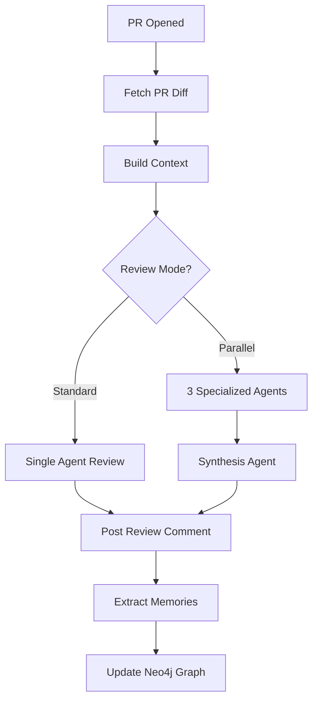

## Overview

Nectr uses **Anthropic's Claude Sonnet 4.6**, one of the most advanced AI models for code understanding, to analyze every pull request. The AI doesn't just lint code—it understands context, architectural patterns, and team dynamics to provide intelligent, actionable feedback.

<Info>
Claude Sonnet 4.6 features a 200K token context window, allowing Nectr to analyze entire PR diffs, related files, historical reviews, and production context in a single request.
</Info>

## Review Modes

Nectr supports two AI analysis modes:

<CardGroup cols={2}>
  <Card title="Standard Mode" icon="brain">
    **Single agentic loop** with 8 MCP-style tools for code search, issue fetching, and error lookup. Best for most use cases.
  </Card>
  <Card title="Parallel Mode" icon="diagram-project">
    **Three specialized agents** run concurrently (security, performance, style), with a synthesis agent combining insights. Enable with `PARALLEL_REVIEW_AGENTS=true`.
  </Card>
</CardGroup>

### Standard Mode (Default)

A single Claude instance orchestrates the review with access to:

```python app/services/ai_service.py
AVAILABLE_TOOLS = [
    "search_code",           # Semantic code search across repository
    "get_file_content",      # Fetch full file content
    "get_related_prs",       # Find PRs touching same files
    "get_file_experts",      # Identify developers who own these files
    "fetch_linear_issues",   # Pull linked Linear tasks
    "fetch_sentry_errors",   # Get production errors for changed files
    "search_slack_messages", # Find relevant team discussions
    "query_neo4j",          # Custom graph queries
]
```

Claude decides which tools to use based on the PR content, building a complete picture before providing feedback.

### Parallel Mode

Enable with:

```bash .env
PARALLEL_REVIEW_AGENTS=true
```

Three specialized agents analyze the PR concurrently:

<Steps>
  <Step title="Security Agent">
    Focuses on:
    - SQL injection vulnerabilities
    - XSS and CSRF risks
    - Authentication/authorization flaws
    - Secret exposure
    - Dependency vulnerabilities
  </Step>

  <Step title="Performance Agent">
    Focuses on:
    - Database query optimization (N+1 queries, missing indexes)
    - Memory leaks and resource exhaustion
    - Inefficient algorithms (O(n²) loops)
    - Caching opportunities
    - Async/await misuse
  </Step>

  <Step title="Style Agent">
    Focuses on:
    - Code readability and naming conventions
    - Documentation completeness
    - Type hint coverage (Python) or TypeScript strict mode
    - Error handling patterns
    - Test coverage gaps
  </Step>

  <Step title="Synthesis Agent">
    Combines all three reports into:
    - Unified summary with prioritized findings
    - De-duplicated issues
    - Final verdict (APPROVE, REQUEST_CHANGES, COMMENT)
    - Inline suggestions mapped to specific lines
  </Step>
</Steps>

<Warning>
Parallel mode uses 4x the Claude API tokens (3 specialized agents + 1 synthesis agent). Monitor costs carefully.
</Warning>

## Analysis Flow

Here's how Claude analyzes a PR:



### Context Building

Before AI analysis, Nectr gathers:

1. **PR Diff**: Full code changes with line numbers
2. **File Content**: Complete file context for changed files
3. **Mem0 Memories**: Project patterns, developer habits, past decisions
4. **Neo4j Graph**: File experts, related PRs, ownership data
5. **Linear Issues**: Linked tasks and feature descriptions
6. **Sentry Errors**: Production errors in modified files
7. **Slack Messages**: Relevant team discussions

All context is injected into Claude's prompt, ensuring reviews are grounded in reality.

## Review Verdicts

Claude returns one of three verdicts:

<AccordionGroup>
  <Accordion title="APPROVE">
    **When:** No significant issues found. Code quality is high, tests pass, and changes align with project patterns.

    **Example:**
    ```
    ✅ APPROVE

    Clean refactoring with comprehensive tests. The new async context manager
    pattern matches existing usage in auth/dependencies.py. No issues found.
    ```
  </Accordion>

  <Accordion title="REQUEST_CHANGES">
    **When:** Critical issues require fixes before merging (security vulnerabilities, breaking changes, major bugs).

    **Example:**
    ```
    ❌ REQUEST_CHANGES

    Security issue: User input is directly interpolated into SQL query at
    repos.py:45. This creates a SQL injection vulnerability.

    Required fix: Use parameterized query:
    SELECT * FROM installations WHERE repo_full_name = $1
    ```
  </Accordion>

  <Accordion title="COMMENT">
    **When:** Minor issues or suggestions that don't block merging (style improvements, optimization opportunities, documentation gaps).

    **Example:**
    ```
    💬 COMMENT

    Consider adding type hints to improve IDE autocomplete:

    -def get_repo_health(repo):
    +def get_repo_health(repo: str) -> dict:

    Not blocking, but would improve developer experience.
    ```
  </Accordion>
</AccordionGroup>

## Inline Suggestions

Claude provides actionable inline comments with:

- **File and line number**: Pinpoints exact location
- **Severity**: Critical, High, Medium, Low
- **Category**: Security, Performance, Bug, Style
- **Suggested fix**: Code snippet showing correction
- **Reasoning**: Why the change matters

Example:

```python
# repos.py:67
# Severity: High | Category: Performance

# ❌ Current:
async def get_all_repos(db: AsyncSession):
    result = await db.execute(select(Installation))
    installations = result.scalars().all()
    for inst in installations:
        inst.user = await db.execute(select(User).where(User.id == inst.user_id))
    return installations

# ✅ Suggested (eliminates N+1 query):
async def get_all_repos(db: AsyncSession):
    result = await db.execute(
        select(Installation).options(selectinload(Installation.user))
    )
    return result.scalars().all()

# Reasoning: Current code executes 1 + N queries (1 for installations,
# N for users). Use SQLAlchemy's selectinload to fetch in 2 queries total.
```

## Tool Usage Examples

### search_code

Claude uses semantic search to find similar patterns:

```python
# Claude's internal reasoning:
# "Let me check how authentication is handled elsewhere in this repo."

result = await tools.search_code(
    repo="owner/repo",
    query="JWT token validation",
    limit=5,
)

# Returns:
[
    {"file": "app/auth/dependencies.py", "line": 23, "snippet": "..."},
    {"file": "app/auth/jwt_utils.py", "line": 45, "snippet": "..."},
]
```

### get_file_experts

Identifies who to tag for domain-specific reviews:

```python
experts = await tools.get_file_experts(
    repo="owner/repo",
    paths=["app/services/pr_review_service.py"],
)

# Returns:
[
    {"login": "alice", "touch_count": 47},
    {"login": "bob", "touch_count": 23},
]

# Claude includes in review:
# "Consider asking @alice to review this change to pr_review_service.py,
# as she's the primary maintainer (47 prior commits)."
```

### fetch_sentry_errors

Grounds analysis in production reality:

```python
errors = await tools.fetch_sentry_errors(
    project="backend",
    filename="app/services/context_service.py",
)

# Returns:
[
    {
        "title": "AttributeError: 'NoneType' object has no attribute 'search'",
        "count": 142,
        "last_seen": "2026-03-09T14:23:11Z",
    }
]

# Claude includes in review:
# "⚠️ Warning: This file has 142 production errors in the last 7 days
# related to None checks. Ensure memory_adapter is properly initialized
# before calling .search()."
```

## Customizing Analysis

Control AI behavior via environment variables:

```bash .env
# Model selection
ANTHROPIC_MODEL=claude-sonnet-4.6-20250514  # Default

# Parallel agents
PARALLEL_REVIEW_AGENTS=false  # Set true for specialized agents

# Review depth
MAX_CONTEXT_FILES=10  # How many related files to analyze
MAX_RELATED_PRS=5     # Historical PRs to consider

# Strictness
REQUIRE_TESTS=true          # Fail reviews without tests
REQUIRE_TYPE_HINTS=false    # Enforce type annotations
BLOCK_TODO_COMMENTS=false   # Prevent merging with TODO comments
```

<Note>
These environment variables are examples—check `app/core/config.py` in the source for the full list.
</Note>

## Best Practices

<AccordionGroup>
  <Accordion title="Seed Mem0 with Project Patterns">
    Before the first review, add 5-10 core patterns to Mem0:

    ```bash
    curl -X POST /api/v1/memory \
      -d '{"content": "All database queries use async SQLAlchemy sessions"}'
    ```

    This helps Claude align reviews with your standards from day one.
  </Accordion>

  <Accordion title="Use Parallel Mode for Critical PRs">
    Enable `PARALLEL_REVIEW_AGENTS=true` for:
    - Security-sensitive changes (auth, payment, data access)
    - Performance-critical paths (API endpoints, database queries)
    - Large refactors (>500 lines changed)

    Standard mode is sufficient for routine feature development.
  </Accordion>

  <Accordion title="Review AI Feedback">
    Not all AI suggestions are correct. Encourage developers to:
    - Push back on incorrect feedback
    - Add clarifying memories when AI misunderstands patterns
    - Report false positives to improve future reviews
  </Accordion>
</AccordionGroup>

## Troubleshooting

<AccordionGroup>
  <Accordion title="Reviews Are Too Strict">
    **Symptom:** Every PR gets REQUEST_CHANGES, even for minor changes.

    **Fix:**
    1. Review Mem0 patterns—remove overly strict rules
    2. Add memories clarifying acceptable exceptions
    3. Lower `REQUIRE_TESTS` or `REQUIRE_TYPE_HINTS` if too aggressive
  </Accordion>

  <Accordion title="Reviews Are Too Lenient">
    **Symptom:** AI approves PRs with obvious bugs.

    **Fix:**
    1. Enable parallel mode for deeper analysis
    2. Add negative examples to Mem0 ("This pattern caused bugs in PR #123")
    3. Ensure Sentry integration is configured to surface production errors
  </Accordion>

  <Accordion title="High API Costs">
    **Symptom:** Anthropic bill is unexpectedly high.

    **Fix:**
    1. Disable parallel mode (`PARALLEL_REVIEW_AGENTS=false`)
    2. Reduce `MAX_CONTEXT_FILES` and `MAX_RELATED_PRS`
    3. Limit reviews to specific repos or file patterns
    4. Cache Claude responses for repeated PRs (custom implementation)
  </Accordion>
</AccordionGroup>

## Next Steps

<CardGroup cols={2}>
  <Card title="Parallel Agents Guide" icon="diagram-project" href="/developers/parallel-agents">
    Learn how to configure and optimize parallel agent reviews
  </Card>
  <Card title="Semantic Memory" icon="brain-circuit" href="/features/semantic-memory">
    Understand how Mem0 improves review quality over time
  </Card>
</CardGroup>
