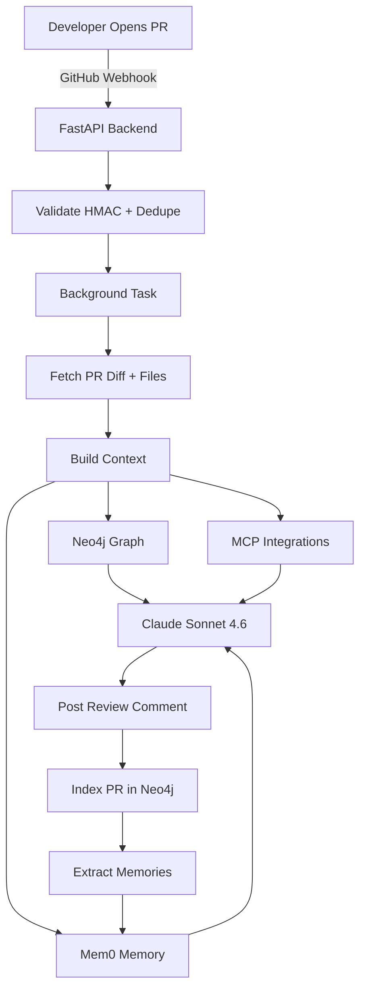

## System Architecture

Nectr is a full-stack AI agent with a FastAPI backend, Next.js frontend, and three key data stores:



<Info>
  The entire flow from webhook receipt to review comment takes **15-45 seconds** depending on PR size and context complexity.
</Info>

## Core Components

<CardGroup cols={2}>
  <Card title="FastAPI Backend" icon="server">
    Python 3.14 + FastAPI + Uvicorn
    
    - **Hosted on**: Railway (auto-deploys from `main` branch)
    - **Database**: PostgreSQL (asyncpg + SQLAlchemy async)
    - **Auth**: GitHub OAuth → JWT httpOnly cookie
    - **Workers**: Background tasks via `BackgroundTasks`
  </Card>

  <Card title="Next.js Frontend" icon="react">
    Next.js 15 + React 19 + TypeScript
    
    - **Hosted on**: Vercel
    - **Styling**: TailwindCSS 4 + custom dark theme
    - **State**: React Query (TanStack Query v5)
    - **Auth**: JWT cookie + `withCredentials: true`
  </Card>

  <Card title="Neo4j Graph" icon="git-branch">
    Stores structural code relationships
    
    - **Nodes**: Repository, File, PullRequest, Developer, Issue
    - **Edges**: CONTAINS, TOUCHES, AUTHORED_BY, CLOSES, CONTRIBUTED_TO
    - **Queries**: File experts, related PRs, code ownership
  </Card>

  <Card title="Mem0 Memory" icon="brain">
    Long-term semantic memory
    
    - **Scoped by**: `project_id=repo`, `user_id=developer`
    - **Types**: project_pattern, decision, developer_strength, risk_module, contributor_profile
    - **API**: v2 search with filters
  </Card>
</CardGroup>

## Step-by-Step: PR Review Flow

### 1. GitHub Webhook Event

When a developer opens or updates a PR, GitHub sends a webhook:

```http
POST https://your-backend.up.railway.app/api/v1/webhooks/github
X-GitHub-Event: pull_request
X-Hub-Signature-256: sha256=...

{
  "action": "opened" | "synchronize" | "reopened",
  "pull_request": {
    "number": 42,
    "title": "Add user authentication",
    "body": "Fixes #123\n\nImplements JWT-based auth...",
    "user": { "login": "alice" },
    "head": { "sha": "a1b2c3d4e5f6" }
  },
  "repository": { "full_name": "org/repo" }
}
```

**Backend validation** (app/api/v1/webhooks.py:30-80):

```python
# 1. Verify HMAC-SHA256 signature
expected_sig = hmac.new(webhook_secret.encode(), body, hashlib.sha256).hexdigest()
if not hmac.compare_digest(f"sha256={expected_sig}", signature):
    raise HTTPException(status_code=401, detail="Invalid signature")

# 2. Deduplicate (ignore duplicate events within 1 hour)
existing_event = await db.execute(
    select(Event).where(
        Event.repo_full_name == repo_full_name,
        Event.pr_number == pr_number,
        Event.event_type == action,
        Event.created_at > datetime.now() - timedelta(hours=1)
    )
)
if existing_event.scalar_one_or_none():
    return {"status": "duplicate", "message": "Event already processed"}

# 3. Create Event record
event = Event(
    repo_full_name=repo_full_name,
    pr_number=pr_number,
    event_type=action,
    payload=payload_dict,
    status="pending"
)
db.add(event)
await db.commit()

# 4. Spawn background task (non-blocking)
background_tasks.add_task(pr_review_service.process_pr_review, payload, event, db)

return {"status": "accepted"}
```

<Tip>
  Nectr returns HTTP 200 immediately, then processes the PR review in the background. This prevents GitHub webhook timeouts (10s limit).
</Tip>

### 2. Fetch PR Data

The background task starts by fetching PR details from GitHub:

```python
# app/services/pr_review_service.py:496-499
diff = await github_client.get_pr_diff(owner, repo, pr_number)
files = await github_client.get_pr_files(owner, repo, pr_number)
```

**Example `diff` (unified format)**:
```diff
--- a/src/auth/middleware.py
+++ b/src/auth/middleware.py
@@ -10,6 +10,7 @@
 def authenticate(request: Request):
     token = request.cookies.get("access_token")
     if not token:
-        return None
+        raise HTTPException(status_code=401, detail="Not authenticated")
     return verify_jwt(token)
```

**Example `files` array**:
```json
[
  {
    "filename": "src/auth/middleware.py",
    "status": "modified",
    "additions": 12,
    "deletions": 3,
    "patch": "@@ -10,6 +10,7 @@\n def authenticate...\n+        raise HTTPException..."
  },
  {
    "filename": "tests/test_auth.py",
    "status": "added",
    "additions": 45,
    "deletions": 0,
    "patch": "@@ -0,0 +1,45 @@\n+import pytest..."
  }
]
```

### 3. Build Review Context

Nectr gathers contextual intelligence from multiple sources **in parallel**:

```python
# app/services/pr_review_service.py:512-523
issue_details, open_pr_conflicts, candidate_issues, related_prs = await asyncio.gather(
    _fetch_issue_details(owner, repo, issue_refs),
    _get_open_pr_conflicts(owner, repo, pr_number, file_paths),
    _find_candidate_issues(owner, repo, pr_title, pr_body, file_paths, set(issue_refs)),
    graph_builder.get_related_prs(repo_full_name, file_paths[:10], top_k=5),
    return_exceptions=True,
)
```

<Tabs>
  <Tab title="Mem0 Semantic Memory">
    ```python
    # app/services/context_service.py:76-84
    project_memories = await memory_adapter.search_relevant(
        repo=repo_full_name,
        query=f"{pr_title} {pr_description} {file_paths}",
        developer=None,
        top_k=12
    )
    developer_memories = await memory_adapter.search_relevant(
        repo=repo_full_name,
        query="Developer patterns, strengths, recurring issues",
        developer=author,
        top_k=5
    )
    ```
    
    **Example memories returned**:
    ```json
    [
      {
        "memory": "Always use async/await for database queries",
        "metadata": {"memory_type": "project_pattern", "user_id": "project"}
      },
      {
        "memory": "@alice tends to miss error handling in edge cases",
        "metadata": {"memory_type": "developer_pattern", "user_id": "alice"}
      }
    ]
    ```
  </Tab>

  <Tab title="Neo4j Structural Context">
    ```cypher
    -- File experts: developers who most frequently touch these files
    UNWIND $paths AS path
    MATCH (pr:PullRequest {repo: $repo})-[:TOUCHES]->(f:File {repo: $repo, path: path})
    MATCH (pr)-[:AUTHORED_BY]->(d:Developer)
    RETURN d.login AS login, count(*) AS touch_count
    ORDER BY touch_count DESC
    LIMIT 5
    ```
    
    **Example result**:
    ```json
    [
      {"login": "alice", "touch_count": 23},
      {"login": "bob", "touch_count": 12}
    ]
    ```
    
    ```cypher
    -- Related past PRs: PRs that touched the same files
    UNWIND $paths AS path
    MATCH (pr:PullRequest {repo: $repo})-[:TOUCHES]->(f:File {repo: $repo, path: path})
    WHERE pr.verdict IS NOT NULL
    WITH pr, count(DISTINCT f) AS overlap
    ORDER BY overlap DESC
    LIMIT 5
    RETURN pr.number, pr.title, pr.author, pr.verdict, overlap
    ```
  </Tab>

  <Tab title="GitHub API">
    ```python
    # Parse issue references from PR body/title
    issue_refs = _parse_issue_refs(pr_body, pr_title)
    # Example: [123, 456] from "Fixes #123\nCloses #456"
    
    # Fetch full issue details
    issue_details = await asyncio.gather(
        *[github_client.get_issue(owner, repo, n) for n in issue_refs]
    )
    
    # Check for open PR conflicts (same files)
    open_prs = await github_client.get_repo_pull_requests(owner, repo, state="open")
    for pr in open_prs:
        pr_files = await github_client.get_pr_files_list(owner, repo, pr["number"])
        overlap = current_files_set & set(pr_files)
        if overlap:
            conflicts.append({"number": pr["number"], "overlap": overlap})
    ```
  </Tab>

  <Tab title="MCP Integrations (Optional)">
    If configured, Nectr pulls live data from third-party tools:
    
    ```python
    # app/mcp/client.py
    
    # Linear: linked issues
    issues = await mcp_client.get_linear_issues(
        team_id="",
        query=pr_title
    )
    
    # Sentry: production errors for modified files
    errors = await mcp_client.get_sentry_errors(
        project=repo,
        filename=file_path
    )
    
    # Slack: relevant channel messages
    messages = await mcp_client.get_slack_messages(
        query=pr_title
    )
    ```
    
    <Info>
      All MCP integrations gracefully degrade when not configured. Set `LINEAR_MCP_URL`, `SENTRY_MCP_URL`, or `SLACK_MCP_URL` to enable.
    </Info>
  </Tab>
</Tabs>

### 4. AI Analysis (Agentic Loop)

Nectr runs an **agentic review loop** powered by Claude Sonnet 4.6. The AI has access to 8 tools and fetches context on-demand:

```python
# app/services/pr_review_service.py:566-569
review_result = await ai_service.analyze_pull_request_agentic(
    pr, diff, files, tool_executor, issue_refs=issue_refs
)
```

#### Available Tools

During the review, Claude can call any of these tools:

<AccordionGroup>
  <Accordion title="read_file(path: str)" icon="file">
    Fetches the full content of a file at HEAD commit.
    
    ```python
    # Example usage by AI:
    content = await read_file("src/auth/middleware.py")
    # Returns: "def authenticate(request: Request):\n    token = ..."
    ```
    
    **Truncation**: Files larger than 8,000 chars are truncated with `"... (truncated at 8,000 chars)"`.
  </Accordion>

  <Accordion title="search_project_memory(query: str)" icon="search">
    Searches Mem0 for project-wide patterns, rules, and decisions.
    
    ```python
    results = await search_project_memory("authentication patterns")
    # Returns:
    # - Always use bcrypt for password hashing
    # - JWT tokens expire after 24 hours
    # - Refresh tokens stored in httpOnly cookies
    ```
  </Accordion>

  <Accordion title="search_developer_memory(developer: str, query: str)" icon="user">
    Searches Mem0 for developer-specific patterns and strengths.
    
    ```python
    results = await search_developer_memory("alice", "common issues")
    # Returns:
    # - @alice often forgets to add error handling
    # - @alice excels at SQL query optimization
    ```
  </Accordion>

  <Accordion title="get_file_history(paths: list[str])" icon="clock">
    Queries Neo4j for file experts and related past PRs.
    
    ```python
    history = await get_file_history(["src/auth/middleware.py"])
    # Returns:
    # File experts:
    #   @alice — 23 PRs
    #   @bob — 12 PRs
    # Related past PRs:
    #   PR #120 [APPROVE] by @alice: Add JWT refresh token logic
    ```
  </Accordion>

  <Accordion title="get_issue_details(numbers: list[int])" icon="bug">
    Fetches full GitHub issue details by number.
    
    ```python
    issues = await get_issue_details([123, 456])
    # Returns:
    # Issue #123 [open]: Users getting 401 errors after token expires
    #   Body: "When JWT expires, users are not redirected to login..."
    ```
  </Accordion>

  <Accordion title="search_open_issues(keywords: str)" icon="search">
    Searches candidate open issues by keyword overlap.
    
    ```python
    matches = await search_open_issues("authentication token")
    # Returns:
    # Issue #123: Users getting 401 errors after token expires
    # Issue #145: Refresh token endpoint returns 500
    ```
  </Accordion>

  <Accordion title="get_linked_issues(query: str, source: 'linear' | 'github')" icon="link">
    Fetches issues from Linear or GitHub via MCP integration.
    
    ```python
    issues = await get_linked_issues("authentication", source="linear")
    # Returns:
    # Linked linear issues for 'authentication':
    #   #ENG-456 [in progress]: Implement OAuth refresh flow
    ```
  </Accordion>

  <Accordion title="get_related_errors(files: list[str])" icon="alert-triangle">
    Fetches recent Sentry errors for modified files.
    
    ```python
    errors = await get_related_errors(["src/auth/middleware.py"])
    # Returns:
    # Related Sentry errors for modified files:
    #   [245x] JWTDecodeError: Invalid token signature
    #     — culprit: src/auth/middleware.py:authenticate
    #     (last seen: 2024-03-10 14:32:11)
    ```
  </Accordion>
</AccordionGroup>

#### Example Agentic Loop

```python
# Simplified illustration of the agentic loop

messages = [
    {"role": "user", "content": f"Review this PR:\n{diff}\n{context}"}
]

while True:
    response = await anthropic_client.messages.create(
        model="claude-sonnet-4.6",
        messages=messages,
        tools=REVIEW_TOOLS
    )
    
    if response.stop_reason == "end_turn":
        # AI finished, extract summary + verdict
        summary = response.content[0].text
        break
    
    if response.stop_reason == "tool_use":
        # AI wants to call a tool
        for tool_call in response.content:
            if tool_call.type == "tool_use":
                tool_name = tool_call.name
                tool_input = tool_call.input
                tool_result = await tool_executor.execute(tool_name, tool_input)
                
                messages.append({
                    "role": "assistant",
                    "content": response.content
                })
                messages.append({
                    "role": "user",
                    "content": [
                        {
                            "type": "tool_result",
                            "tool_use_id": tool_call.id,
                            "content": tool_result
                        }
                    ]
                })
```

<Info>
  The agentic loop typically runs 2-5 turns. Claude rarely needs more than 3 tool calls to produce a comprehensive review.
</Info>

### 5. Post Review Comment

After AI analysis completes, Nectr posts the review to GitHub:

```python
# app/services/pr_review_service.py:717-723
await github_client.post_pr_review(
    owner, repo, pr_number,
    commit_id=head_sha,
    body=comment_body,
    event="APPROVE" | "REQUEST_CHANGES" | "COMMENT",
    comments=inline_comments
)
```

**Review comment structure**:

```markdown
Hi I am Nectr - AI code review agent built by [Dhanush Chalicheemala](https://x.com/dhanush_chali)

## Verdict: **APPROVE**

This PR implements JWT authentication middleware correctly. Key changes:
- ✅ Raises HTTPException(401) for missing tokens
- ✅ Uses `verify_jwt()` for token validation
- ✅ Adds comprehensive test coverage

### Minor Suggestions:
- Consider adding rate limiting to prevent brute-force attacks
- Add refresh token rotation for enhanced security

## Resolved Issues
- 🟢 Closes [#123: Users getting 401 errors after token expires](https://github.com/org/repo/issues/123)

## 🔍 Potentially Resolves
_These open issues appear to be resolved by this PR's changes, even though they weren't explicitly mentioned:_
- 🟡 [#145: Refresh token endpoint returns 500](https://github.com/org/repo/issues/145) — This PR fixes the root cause by validating tokens before refresh

---
*If you have any concerns, connect with [Dhanush Chalicheemala](https://x.com/dhanush_chali)*
```

**Inline suggestions** (GitHub review comments):

```python
# Example inline comment with suggestion block
{
    "path": "src/auth/middleware.py",
    "line": 15,
    "side": "RIGHT",
    "body": "Consider adding a try-except block to handle JWT decode errors gracefully.\n\n```suggestion\ntry:\n    return verify_jwt(token)\nexcept JWTDecodeError as e:\n    logger.error('JWT decode failed: %s', e)\n    raise HTTPException(status_code=401, detail='Invalid token')\n```"
}
```

<Tip>
  Users can click **Commit suggestion** on GitHub to apply the fix directly.
</Tip>

### 6. Index PR in Neo4j

After posting the review, Nectr updates the knowledge graph:

```cypher
-- Create PullRequest node
MERGE (pr:PullRequest {repo: "org/repo", number: 42})
SET pr.title = "Add user authentication",
    pr.author = "alice",
    pr.verdict = "APPROVE",
    pr.reviewed_at = "2024-03-10T14:32:11Z"

-- Link to Developer
MERGE (d:Developer {login: "alice"})
MERGE (pr)-[:AUTHORED_BY]->(d)
MERGE (d)-[:CONTRIBUTED_TO]->(r:Repository {full_name: "org/repo"})

-- Link to changed Files
UNWIND ["src/auth/middleware.py", "tests/test_auth.py"] AS path
MERGE (file:File {repo: "org/repo", path: path})
ON CREATE SET file.language = "Python"
MERGE (pr)-[:TOUCHES]->(file)

-- Link to closed Issues
UNWIND [123] AS issue_num
MERGE (i:Issue {repo: "org/repo", number: issue_num})
MERGE (pr)-[:CLOSES]->(i)
```

**Graph after indexing**:

```
(Repository:"org/repo")-[:CONTAINS]->(File:"src/auth/middleware.py")
(PullRequest:42)-[:TOUCHES]->(File:"src/auth/middleware.py")
(PullRequest:42)-[:AUTHORED_BY]->(Developer:"alice")
(PullRequest:42)-[:CLOSES]->(Issue:123)
(Developer:"alice")-[:CONTRIBUTED_TO]->(Repository:"org/repo")
```

### 7. Extract Learned Memories

Finally, Claude extracts new memories from the PR:

```python
# app/services/memory_extractor.py:50-80
extracted = await ai_service.extract_memories(
    pr_title="Add user authentication",
    files=files,
    review_summary=summary
)
```

**Example extracted memories**:

```json
[
  {
    "type": "project_pattern",
    "content": "JWT authentication uses httpOnly cookies for security"
  },
  {
    "type": "decision",
    "content": "Switched from session-based auth to JWT tokens (2024-03-10)"
  },
  {
    "type": "developer_strength",
    "content": "@alice writes comprehensive test coverage for auth flows"
  },
  {
    "type": "risk_module",
    "content": "src/auth/middleware.py requires careful review for security vulnerabilities"
  }
]
```

These memories are stored in Mem0 and used to inform future reviews.

## Parallel Review Mode (Experimental)

Set `PARALLEL_REVIEW_AGENTS=true` to run 3 specialized agents concurrently:

```python
# app/services/ai_service.py:200-220
if settings.PARALLEL_REVIEW_AGENTS:
    security_review, performance_review, style_review = await asyncio.gather(
        analyze_security(pr, diff, files),
        analyze_performance(pr, diff, files),
        analyze_style(pr, diff, files)
    )
    
    # Synthesis agent combines all three
    final_review = await synthesize_reviews(
        security_review, performance_review, style_review
    )
```

<Warning>
  Parallel mode uses **4× the Claude API quota** (3 agent reviews + 1 synthesis) but reduces latency by ~30% due to concurrent execution.
</Warning>

## Data Flow Summary

<Steps>
  <Step title="Webhook Received">
    GitHub → FastAPI `/api/v1/webhooks/github` (validates HMAC, deduplicates, spawns background task)
  </Step>

  <Step title="PR Data Fetched">
    Background task → GitHub REST API (fetch diff + files)
  </Step>

  <Step title="Context Gathered">
    Parallel queries → Neo4j + Mem0 + GitHub + MCP integrations
  </Step>

  <Step title="AI Analysis">
    Agentic loop → Claude Sonnet 4.6 with 8 on-demand tools
  </Step>

  <Step title="Review Posted">
    GitHub REST API → Post review comment with inline suggestions
  </Step>

  <Step title="Graph Updated">
    Neo4j write → Index PR + edges (AUTHORED_BY, TOUCHES, CLOSES)
  </Step>

  <Step title="Memories Extracted">
    Claude extraction → Mem0 storage (project patterns + developer profiles)
  </Step>
</Steps>

## Next Steps

<CardGroup cols={2}>
  <Card title="PR Reviews Deep Dive" icon="git-pull-request" href="/features/pr-reviews">
    Explore the review workflow in detail
  </Card>

  <Card title="Knowledge Graph" icon="git-branch" href="/features/knowledge-graph">
    Learn how Neo4j tracks code relationships
  </Card>

  <Card title="Semantic Memory" icon="brain" href="/features/semantic-memory">
    Understand how Mem0 stores long-term context
  </Card>

  <Card title="AI Analysis" icon="sparkles" href="/features/ai-analysis">
    Deep dive into the agentic review process
  </Card>
</CardGroup>
