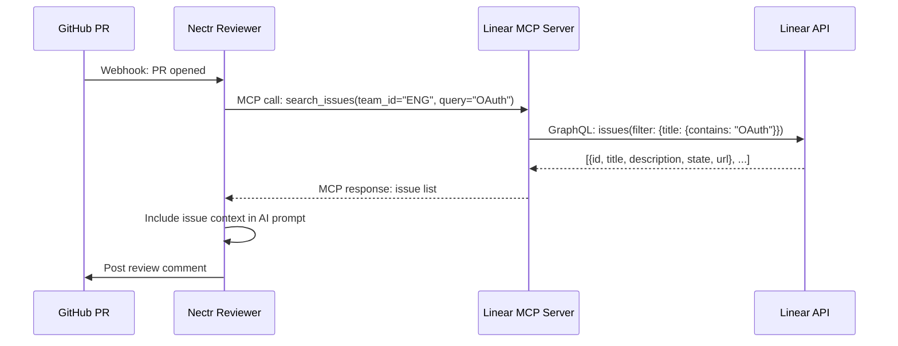

## Overview

The **Linear integration** pulls issue context into PR reviews so Nectr's AI can understand what problem the code is solving. When reviewing a PR, Nectr queries the Linear MCP server for issues matching the PR's topic or linked directly in the description.

**Example:** A PR titled "Fix OAuth redirect loop" triggers a search for Linear issues with "OAuth" or "authentication" keywords. Nectr includes issue descriptions in the review context.

---

## How It Works

Linear integration uses the **Model Context Protocol (MCP)** — Nectr acts as an **MCP client** and calls a **Linear MCP server** to fetch issues.



### Graceful Degradation

If `LINEAR_MCP_URL` is not set or the Linear MCP server is offline:
- Nectr logs an info message: `"LINEAR_MCP_URL not configured — skipping Linear issue fetch"`
- Returns an empty list `[]`
- **Review continues** without Linear context

---

## Prerequisites

1. **Linear Workspace** (free or paid plan)
2. **Linear API Key** ([linear.app/settings/api](https://linear.app/settings/api))
3. **Linear MCP Server** (self-hosted or cloud-deployed)

---

## Setup Guide

### 1. Deploy a Linear MCP Server

You need an **external MCP server** that implements the `search_issues` tool. This server bridges Linear's GraphQL API and the MCP protocol.

<Tabs>
  <Tab title="Docker (Recommended)">
    ```bash
    docker run -d \
      --name linear-mcp-server \
      -e LINEAR_API_KEY=lin_api_... \
      -p 8001:8000 \
      your-org/linear-mcp-server:latest
    ```
  </Tab>
  <Tab title="Self-Hosted Python">
    ```bash
    git clone https://github.com/your-org/linear-mcp-server
    cd linear-mcp-server
    pip install -r requirements.txt
    LINEAR_API_KEY=lin_api_... uvicorn main:app --port 8001
    ```
  </Tab>
  <Tab title="Hosted Service">
    Use a managed MCP hosting service (e.g., Railway, Render) to deploy the Linear MCP server.
  </Tab>
</Tabs>

### 2. Set Environment Variables

Add the following to Nectr's `.env`:

```bash title=".env"
# Linear MCP server URL
LINEAR_MCP_URL=http://linear-mcp-server:8001

# Linear API key (passed as Authorization header)
LINEAR_API_KEY=lin_api_...
```

### 3. Restart Nectr

```bash
docker compose restart backend
# or
uvicorn app.main:app --reload
```

---

## Usage

### Automatic Issue Fetching

When a PR is opened, Nectr automatically:

1. **Extracts keywords** from the PR title and description
2. **Calls Linear MCP server** with `search_issues(team_id, query)`
3. **Includes issue context** in the AI prompt

**Example:**

```python
from app.mcp.client import mcp_client

issues = await mcp_client.get_linear_issues(
    team_id="ENG",
    query="authentication bug"
)
# Returns: [
#   {"id": "ENG-123", "title": "Fix OAuth redirect loop", "state": "In Progress", "url": "..."},
#   {"id": "ENG-145", "title": "Auth token expiration", "state": "Backlog", "url": "..."},
# ]
```

### Manual Testing

Test the Linear MCP server directly:

```bash
curl -X POST http://linear-mcp-server:8001/ \
  -H "Content-Type: application/json" \
  -H "Authorization: Bearer lin_api_..." \
  -d '{
    "jsonrpc": "2.0",
    "id": 1,
    "method": "tools/call",
    "params": {
      "name": "search_issues",
      "arguments": {"team_id": "ENG", "query": "OAuth"}
    }
  }'
```

**Expected Response:**
```json
{
  "result": {
    "content": [
      {
        "type": "text",
        "text": "[{\"id\": \"ENG-123\", \"title\": \"Fix OAuth redirect loop\", \"state\": \"In Progress\"}]"
      }
    ]
  }
}
```

---

## Implementation Details

### MCPClientManager

**File:** `app/mcp/client.py:45`

```python
async def get_linear_issues(self, team_id: str, query: str) -> list[dict]:
    """Pull issues / tasks from the Linear MCP server matching *query*.

    Args:
        team_id: Linear team identifier (e.g. "ENG").
        query:   Free-text search query (topic, feature area, keyword).

    Returns:
        List of issue dicts: {id, title, state, url, description}.
        Empty list if Linear MCP is not configured or the call fails.
    """
    if not settings.LINEAR_MCP_URL:
        logger.info(
            "LINEAR_MCP_URL not configured — skipping Linear issue fetch "
            "(set LINEAR_MCP_URL + LINEAR_API_KEY to enable)"
        )
        return []

    return await self.query_mcp_server(
        server_url=settings.LINEAR_MCP_URL,
        tool_name="search_issues",
        args={"team_id": team_id, "query": query},
        auth_token=settings.LINEAR_API_KEY,
    )
```

### MCP Request Format

**File:** `app/mcp/client.py:116`

```python
async def query_mcp_server(
    self,
    server_url: str,
    tool_name: str,
    args: dict,
    auth_token: str | None = None,
) -> list[dict] | dict:
    """Generic method to call any MCP server tool over HTTP/SSE JSON-RPC."""
    payload = {
        "jsonrpc": "2.0",
        "id": 1,
        "method": "tools/call",
        "params": {"name": tool_name, "arguments": args},
    }
    headers: dict[str, str] = {"Content-Type": "application/json"}
    if auth_token:
        headers["Authorization"] = f"Bearer {auth_token}"

    async with httpx.AsyncClient(timeout=10.0) as client:
        response = await client.post(
            f"{server_url.rstrip('/')}/",
            json=payload,
            headers=headers,
        )
        response.raise_for_status()
        data = response.json()

    # Unwrap MCP content array: {"result": {"content": [{"type": "text", "text": "..."}]}}
    result = data.get("result", data)
    content = result.get("content", result)
    # ...
```

---

## Configuration Reference

<ParamField path="LINEAR_MCP_URL" type="string" required>
  Base URL of the Linear MCP server (e.g., `http://linear-mcp-server:8001`)
</ParamField>

<ParamField path="LINEAR_API_KEY" type="string" required>
  Linear API key for authentication. Generate at [linear.app/settings/api](https://linear.app/settings/api).
</ParamField>

---

## Troubleshooting

<AccordionGroup>
  <Accordion title="No issues returned">
    **Cause:** Linear MCP server is not running or `LINEAR_MCP_URL` is incorrect.

    **Fix:**
    - Test the MCP server directly: `curl http://linear-mcp-server:8001/`
    - Check logs: `docker logs linear-mcp-server`
    - Verify `LINEAR_MCP_URL` is set in Nectr's `.env`
  </Accordion>
  <Accordion title="Error: HTTP 401 Unauthorized">
    **Cause:** `LINEAR_API_KEY` is missing or invalid.

    **Fix:**
    - Regenerate API key at [linear.app/settings/api](https://linear.app/settings/api)
    - Ensure key is set in Nectr's `.env` and MCP server's environment
  </Accordion>
  <Accordion title="Timeout errors">
    **Cause:** Linear GraphQL API is slow or MCP server is overloaded.

    **Fix:**
    - Increase timeout: Edit `_MCP_TIMEOUT` in `app/mcp/client.py` (default: 10s)
    - Add caching to the MCP server (cache issue queries for 60s)
  </Accordion>
  <Accordion title="Issues not relevant to PR">
    **Cause:** Search query is too broad or team_id is incorrect.

    **Fix:**
    - Refine query extraction logic in `ReviewToolExecutor`
    - Hardcode `team_id` in `.env` if you only have one team
  </Accordion>
</AccordionGroup>

---

## Next Steps

<CardGroup cols={2}>
  <Card title="MCP Protocol" icon="network-wired" href="/integrations/mcp-protocol">
    Understand how MCP connects Nectr with Linear
  </Card>
  <Card title="Sentry Integration" icon="bug" href="/integrations/sentry">
    Surface production errors in PR reviews
  </Card>
  <Card title="Environment Variables" icon="gear" href="/developers/environment-variables">
    Full configuration reference
  </Card>
</CardGroup>
