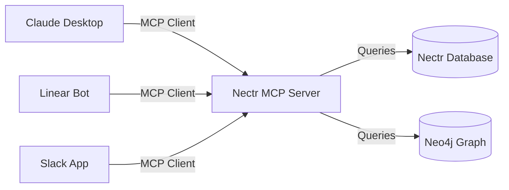

## Overview

Nectr exposes its own review database via the **Model Context Protocol (MCP)** so external tools can pull PR verdicts, contributor stats, and repository health metrics. This is the **outbound** direction — Nectr acts as an **MCP server** that other agents (Linear bots, Claude Desktop, Slack apps) can query.

**Transport:** Server-Sent Events (SSE) at `/mcp/sse`

**Implementation:** `app/mcp/server.py` (FastMCP)

---

## Architecture



Nectr's MCP server provides:
- **4 Tools** — callable functions for fetching review data
- **1 Resource** — streaming recent reviews as JSON

---

## Quick Start

### 1. Nectr MCP Server is Always Running

The MCP server is **automatically mounted** at `/mcp` when Nectr starts. No additional configuration needed.

**File:** `app/mcp/router.py` mounts the SSE endpoint

### 2. Connect from Claude Desktop

Add Nectr to Claude Desktop's MCP configuration:

```json title="~/Library/Application Support/Claude/claude_desktop_config.json" {3-7}
{
  "mcpServers": {
    "nectr": {
      "url": "http://localhost:8000/mcp/sse",
      "transport": "sse"
    }
  }
}
```

<Accordion title="For production deployments">
```json
{
  "mcpServers": {
    "nectr": {
      "url": "https://nectr.yourdomain.com/mcp/sse",
      "transport": "sse"
    }
  }
}
```
</Accordion>

### 3. Test with Claude Desktop

Ask Claude:

> "What are the recent reviews for acme/backend?"

Claude will call Nectr's `get_recent_reviews` tool and display results.

---

## Available Tools

Nectr exposes 4 MCP tools. See [MCP Tools Reference](/integrations/mcp-server/tools) for detailed signatures.

<CardGroup cols={2}>
  <Card title="get_recent_reviews" icon="list">
    Fetch recent PR reviews with verdicts and summaries
  </Card>
  <Card title="get_contributor_stats" icon="users">
    Get top contributors with PR-touch counts from Neo4j
  </Card>
  <Card title="get_pr_verdict" icon="gavel">
    Retrieve AI verdict for a specific PR
  </Card>
  <Card title="get_repo_health" icon="heart-pulse">
    Calculate repository health score (0-100)
  </Card>
</CardGroup>

---

## Manual Testing

### Using `curl` (SSE Stream)

```bash
curl -N http://localhost:8000/mcp/sse
```

**Expected Output:**
```
event: endpoint
data: /mcp/sse

event: message
data: {"jsonrpc":"2.0","id":1,"result":{"capabilities":{"tools":{}}}}
```

### Using MCP Inspector

Install the MCP Inspector CLI:

```bash
npm install -g @modelcontextprotocol/inspector
```

Connect to Nectr:

```bash
mcp-inspector http://localhost:8000/mcp/sse
```

Call a tool:

```bash
> tools.call get_recent_reviews {"repo": "acme/backend", "limit": 5}
```

---

## Configuration

### No Environment Variables Needed

The MCP server is automatically enabled when Nectr starts. It reads data from:

- **PostgreSQL** (via `app/core/database.py`) — PR reviews and verdicts
- **Neo4j** (via `app/services/graph_builder.py`) — Contributor stats

### Optional: Restrict Access

By default, the MCP server is **publicly accessible** at `/mcp/sse`. To restrict access:

<Tabs>
  <Tab title="API Key Middleware (Recommended)">
    Add a middleware to `app/mcp/router.py` that checks for a bearer token:

    ```python
    from fastapi import Header, HTTPException

    async def verify_api_key(authorization: str = Header(...)):
        token = authorization.replace("Bearer ", "")
        if token != settings.MCP_API_KEY:
            raise HTTPException(status_code=401, detail="Invalid API key")

    @router.get("/sse", dependencies=[Depends(verify_api_key)])
    async def mcp_sse_endpoint(request: Request):
        # ...
    ```

    Set `MCP_API_KEY` in `.env`:
    ```bash
    MCP_API_KEY=your-secret-key
    ```
  </Tab>
  <Tab title="IP Allowlist (Infrastructure)">
    Use a reverse proxy (nginx, Cloudflare) to restrict `/mcp/*` to specific IPs:

    ```nginx
    location /mcp/ {
        allow 192.168.1.0/24;
        deny all;
        proxy_pass http://backend:8000;
    }
    ```
  </Tab>
</Tabs>

---

## Deployment

### Docker Compose

The MCP server is included in the default `docker-compose.yml`. No changes needed.

```yaml
services:
  backend:
    build: ./backend
    ports:
      - "8000:8000"  # MCP server accessible at http://localhost:8000/mcp/sse
    environment:
      - DATABASE_URL=...
      - NEO4J_URI=...
```

### Railway / Render / Fly.io

Deploy the backend service as usual. The MCP server will be available at:

```
https://your-backend.up.railway.app/mcp/sse
```

### Kubernetes

Expose the `/mcp` path via an Ingress:

```yaml
apiVersion: networking.k8s.io/v1
kind: Ingress
metadata:
  name: nectr-mcp
spec:
  rules:
  - host: nectr.yourdomain.com
    http:
      paths:
      - path: /mcp
        pathType: Prefix
        backend:
          service:
            name: nectr-backend
            port:
              number: 8000
```

---

## Connecting External Clients

### Claude Desktop

See [Quick Start](#2-connect-from-claude-desktop) above.

### Custom Python Client

Use `httpx` with SSE:

```python
import httpx
import json

async def call_nectr_tool(tool_name: str, args: dict):
    payload = {
        "jsonrpc": "2.0",
        "id": 1,
        "method": "tools/call",
        "params": {"name": tool_name, "arguments": args},
    }
    async with httpx.AsyncClient() as client:
        response = await client.post(
            "http://localhost:8000/mcp/sse",
            json=payload,
        )
        return response.json()

# Example: Get recent reviews
result = await call_nectr_tool("get_recent_reviews", {"repo": "acme/backend", "limit": 10})
print(result)
```

### Linear Bot Integration

Create a Linear bot that queries Nectr's MCP server when an issue is created:

```python
from linear_sdk import LinearClient
from mcp_client import call_nectr_tool

async def on_issue_created(issue):
    # Fetch related PR reviews from Nectr
    reviews = await call_nectr_tool(
        "get_recent_reviews",
        {"repo": issue.repository, "limit": 5}
    )
    # Post a comment on the Linear issue
    await linear.create_comment(
        issue_id=issue.id,
        body=f"Recent reviews: {reviews}"
    )
```

---

## Troubleshooting

<AccordionGroup>
  <Accordion title="Error: Connection refused">
    **Cause:** Nectr backend is not running or `/mcp` endpoint is not mounted.

    **Fix:**
    - Verify Nectr is running: `curl http://localhost:8000/health`
    - Check logs: `docker logs nectr-backend`
    - Ensure `app/mcp/router.py` is imported in `app/main.py`
  </Accordion>
  <Accordion title="Error: No tools available">
    **Cause:** MCP server failed to register tools (likely import error).

    **Fix:**
    - Check logs for `ImportError` or `NameError`
    - Verify `app/mcp/server.py` is not crashing on import
    - Test locally: `python -c "from app.mcp.server import mcp; print(mcp.list_tools())"`
  </Accordion>
  <Accordion title="Empty results from tools">
    **Cause:** Database is empty or Neo4j is not configured.

    **Fix:**
    - Check database connection: `DATABASE_URL` in `.env`
    - Verify Neo4j connection: `NEO4J_URI`, `NEO4J_USERNAME`, `NEO4J_PASSWORD`
    - Run a review to populate the database
  </Accordion>
  <Accordion title="SSE connection drops">
    **Cause:** Reverse proxy or firewall is closing long-lived connections.

    **Fix:**
    - Configure nginx to allow SSE: `proxy_buffering off; proxy_read_timeout 3600s;`
    - Use HTTP/2 (automatically keeps connections alive)
  </Accordion>
</AccordionGroup>

---

## Next Steps

<CardGroup cols={2}>
  <Card title="MCP Tools Reference" icon="wrench" href="/integrations/mcp-server/tools">
    Browse all available MCP tools and signatures
  </Card>
  <Card title="MCP Resources" icon="database" href="/integrations/mcp-server/resources">
    Understand MCP resources for streaming data
  </Card>
  <Card title="MCP Protocol" icon="network-wired" href="/integrations/mcp-protocol">
    Deep dive into how MCP works in Nectr
  </Card>
</CardGroup>
