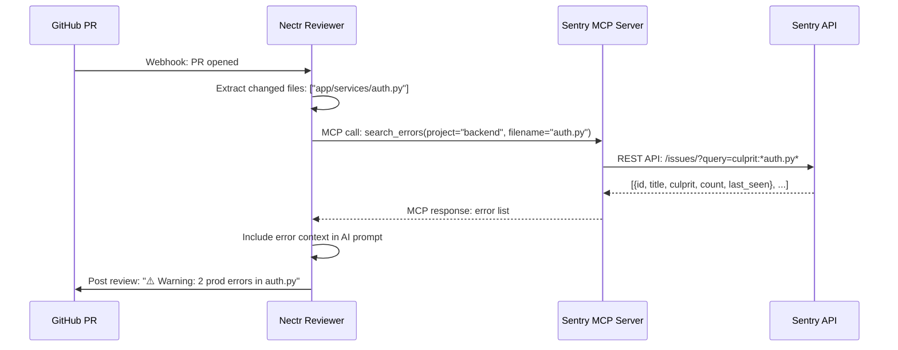

## Overview

The **Sentry integration** pulls production error data into PR reviews. When Nectr reviews a PR, it queries the Sentry MCP server for recent errors related to the files being changed. This helps reviewers catch regressions before merging.

**Example:** A PR modifies `app/services/auth.py`. Nectr fetches Sentry errors where `culprit` contains `auth.py` and includes them in the review context:
- "OAuth token validation failed (seen 127 times in the last 24h)"
- "Redis connection timeout in session refresh (seen 43 times)"

---

## How It Works

Sentry integration uses the **Model Context Protocol (MCP)** — Nectr acts as an **MCP client** and calls a **Sentry MCP server** to fetch errors.



### Graceful Degradation

If `SENTRY_MCP_URL` is not set or the Sentry MCP server is offline:
- Nectr logs an info message: `"SENTRY_MCP_URL not configured — skipping Sentry error fetch"`
- Returns an empty list `[]`
- **Review continues** without Sentry context

---

## Prerequisites

1. **Sentry Account** (free or paid plan)
2. **Sentry Auth Token** ([sentry.io/settings/account/api/auth-tokens/](https://sentry.io/settings/account/api/auth-tokens/))
3. **Sentry MCP Server** (self-hosted or cloud-deployed)

---

## Setup Guide

### 1. Generate a Sentry Auth Token

<Steps>
  <Step title="Navigate to Sentry API Settings">
    Go to [sentry.io/settings/account/api/auth-tokens/](https://sentry.io/settings/account/api/auth-tokens/)
  </Step>
  <Step title="Create New Token">
    - **Name:** `Nectr MCP Server`
    - **Scopes:** `event:read`, `project:read`, `org:read`
  </Step>
  <Step title="Copy Token">
    Save the token immediately — you won't be able to see it again.
  </Step>
</Steps>

### 2. Deploy a Sentry MCP Server

You need an **external MCP server** that implements the `search_errors` tool. This server bridges Sentry's REST API and the MCP protocol.

<Tabs>
  <Tab title="Docker (Recommended)">
    ```bash
    docker run -d \
      --name sentry-mcp-server \
      -e SENTRY_AUTH_TOKEN=sntrys_... \
      -e SENTRY_ORG=your-org \
      -p 8002:8000 \
      your-org/sentry-mcp-server:latest
    ```
  </Tab>
  <Tab title="Self-Hosted Python">
    ```bash
    git clone https://github.com/your-org/sentry-mcp-server
    cd sentry-mcp-server
    pip install -r requirements.txt
    SENTRY_AUTH_TOKEN=sntrys_... uvicorn main:app --port 8002
    ```
  </Tab>
  <Tab title="Hosted Service">
    Use a managed MCP hosting service (e.g., Railway, Render) to deploy the Sentry MCP server.
  </Tab>
</Tabs>

### 3. Set Environment Variables

Add the following to Nectr's `.env`:

```bash title=".env"
# Sentry MCP server URL
SENTRY_MCP_URL=http://sentry-mcp-server:8002

# Sentry auth token (passed as Authorization header)
SENTRY_AUTH_TOKEN=sntrys_...
```

### 4. Restart Nectr

```bash
docker compose restart backend
# or
uvicorn app.main:app --reload
```

---

## Usage

### Automatic Error Fetching

When a PR is opened, Nectr automatically:

1. **Extracts changed files** from the PR diff
2. **Calls Sentry MCP server** for each file: `search_errors(project, filename)`
3. **Includes error context** in the AI prompt

**Example:**

```python
from app.mcp.client import mcp_client

errors = await mcp_client.get_sentry_errors(
    project="backend",
    filename="app/services/auth.py"
)
# Returns: [
#   {"id": "123456", "title": "Redis timeout", "culprit": "auth.py:42", "count": 127, "last_seen": "2026-03-10T10:00:00Z"},
#   {"id": "123457", "title": "OAuth validation error", "culprit": "auth.py:78", "count": 43, "last_seen": "2026-03-10T09:30:00Z"},
# ]
```

### Manual Testing

Test the Sentry MCP server directly:

```bash
curl -X POST http://sentry-mcp-server:8002/ \
  -H "Content-Type: application/json" \
  -H "Authorization: Bearer sntrys_..." \
  -d '{
    "jsonrpc": "2.0",
    "id": 1,
    "method": "tools/call",
    "params": {
      "name": "search_errors",
      "arguments": {"project": "backend", "filename": "auth.py"}
    }
  }'
```

**Expected Response:**
```json
{
  "result": {
    "content": [
      {
        "type": "text",
        "text": "[{\"id\": \"123456\", \"title\": \"Redis timeout\", \"culprit\": \"auth.py:42\", \"count\": 127}]"
      }
    ]
  }
}
```

---

## Implementation Details

### MCPClientManager

**File:** `app/mcp/client.py:70`

```python
async def get_sentry_errors(self, project: str, filename: str) -> list[dict]:
    """Get recent Sentry errors related to a file being reviewed.

    Args:
        project:  Sentry project slug (e.g. "backend").
        filename: File path from the PR diff to filter errors by.

    Returns:
        List of error dicts: {id, title, culprit, count, last_seen}.
        Empty list if Sentry MCP is not configured or the call fails.
    """
    if not settings.SENTRY_MCP_URL:
        logger.info(
            "SENTRY_MCP_URL not configured — skipping Sentry error fetch "
            "(set SENTRY_MCP_URL + SENTRY_AUTH_TOKEN to enable)"
        )
        return []

    return await self.query_mcp_server(
        server_url=settings.SENTRY_MCP_URL,
        tool_name="search_errors",
        args={"project": project, "filename": filename},
        auth_token=settings.SENTRY_AUTH_TOKEN,
    )
```

### MCP Request Format

**File:** `app/mcp/client.py:116`

```python
payload = {
    "jsonrpc": "2.0",
    "id": 1,
    "method": "tools/call",
    "params": {
        "name": "search_errors",
        "arguments": {"project": "backend", "filename": "auth.py"}
    },
}
headers = {
    "Content-Type": "application/json",
    "Authorization": f"Bearer {settings.SENTRY_AUTH_TOKEN}"
}

response = await client.post(
    f"{settings.SENTRY_MCP_URL}/",
    json=payload,
    headers=headers,
)
```

---

## Configuration Reference

<ParamField path="SENTRY_MCP_URL" type="string" required>
  Base URL of the Sentry MCP server (e.g., `http://sentry-mcp-server:8002`)
</ParamField>

<ParamField path="SENTRY_AUTH_TOKEN" type="string" required>
  Sentry auth token for API access. Generate at [sentry.io/settings/account/api/auth-tokens/](https://sentry.io/settings/account/api/auth-tokens/).

  **Required scopes:** `event:read`, `project:read`, `org:read`
</ParamField>

---

## Troubleshooting

<AccordionGroup>
  <Accordion title="No errors returned">
    **Cause:** Sentry MCP server is not running or `SENTRY_MCP_URL` is incorrect.

    **Fix:**
    - Test the MCP server directly: `curl http://sentry-mcp-server:8002/`
    - Check logs: `docker logs sentry-mcp-server`
    - Verify `SENTRY_MCP_URL` is set in Nectr's `.env`
  </Accordion>
  <Accordion title="Error: HTTP 401 Unauthorized">
    **Cause:** `SENTRY_AUTH_TOKEN` is missing, invalid, or lacks required scopes.

    **Fix:**
    - Regenerate token at [sentry.io/settings/account/api/auth-tokens/](https://sentry.io/settings/account/api/auth-tokens/)
    - Ensure scopes include `event:read`, `project:read`, `org:read`
    - Update token in Nectr's `.env` and MCP server's environment
  </Accordion>
  <Accordion title="Timeout errors">
    **Cause:** Sentry API is slow or MCP server is overloaded.

    **Fix:**
    - Increase timeout: Edit `_MCP_TIMEOUT` in `app/mcp/client.py` (default: 10s)
    - Add caching to the MCP server (cache error queries for 60s)
    - Filter errors by date range (last 7 days instead of all-time)
  </Accordion>
  <Accordion title="Errors not relevant to PR">
    **Cause:** `culprit` matching is too broad (e.g., "auth.py" matches "oauth.py").

    **Fix:**
    - Use full file paths in MCP server: `app/services/auth.py` instead of `auth.py`
    - Filter errors by `first_seen` or `last_seen` date (only recent errors)
  </Accordion>
</AccordionGroup>

---

## Next Steps

<CardGroup cols={2}>
  <Card title="MCP Protocol" icon="network-wired" href="/integrations/mcp-protocol">
    Understand how MCP connects Nectr with Sentry
  </Card>
  <Card title="Slack Integration" icon="slack" href="/integrations/slack">
    Fetch relevant channel messages as review context
  </Card>
  <Card title="Environment Variables" icon="gear" href="/developers/environment-variables">
    Full configuration reference
  </Card>
</CardGroup>
