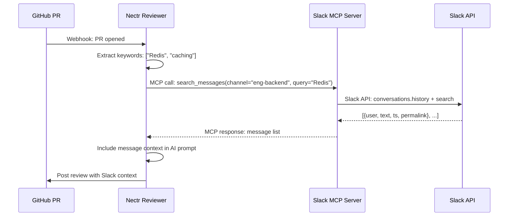

## Overview

The **Slack integration** pulls channel messages into PR reviews. When Nectr reviews a PR, it queries the Slack MCP server for messages related to the PR's topic or linked channels. This helps reviewers understand team discussions and decisions that influenced the code changes.

**Example:** A PR titled "Migrate to Redis Cluster" triggers a search for Slack messages containing "Redis" or "caching". Nectr includes relevant discussions in the review context.

<Info>
**Status:** The Slack integration is **partially implemented**. The MCP client method exists (`get_slack_messages`), but it's not yet called during the review workflow.
</Info>

---

## How It Works

Slack integration uses the **Model Context Protocol (MCP)** — Nectr acts as an **MCP client** and calls a **Slack MCP server** to fetch messages.



### Graceful Degradation

If `SLACK_MCP_URL` is not set or the Slack MCP server is offline:
- Nectr logs an info message: `"SLACK_MCP_URL not configured — skipping Slack message fetch"`
- Returns an empty list `[]`
- **Review continues** without Slack context

---

## Prerequisites

1. **Slack Workspace** (free or paid plan)
2. **Slack Bot Token** with required scopes (see below)
3. **Slack MCP Server** (self-hosted or cloud-deployed)

---

## Setup Guide

### 1. Create a Slack App

<Steps>
  <Step title="Navigate to Slack API">
    Go to [api.slack.com/apps](https://api.slack.com/apps) → **Create New App** → **From scratch**
  </Step>
  <Step title="Configure Bot Scopes">
    Under **OAuth & Permissions** → **Bot Token Scopes**, add:
    - `channels:history` — Read public channel messages
    - `channels:read` — List public channels
    - `search:read` — Search messages
  </Step>
  <Step title="Install App to Workspace">
    Click **Install to Workspace** and authorize the bot.
  </Step>
  <Step title="Copy Bot Token">
    Under **OAuth & Permissions**, copy the **Bot User OAuth Token** (`xoxb-...`).
  </Step>
</Steps>

### 2. Deploy a Slack MCP Server

You need an **external MCP server** that implements the `search_messages` tool. This server bridges Slack's Web API and the MCP protocol.

<Tabs>
  <Tab title="Docker (Recommended)">
    ```bash
    docker run -d \
      --name slack-mcp-server \
      -e SLACK_BOT_TOKEN=xoxb-... \
      -p 8003:8000 \
      your-org/slack-mcp-server:latest
    ```
  </Tab>
  <Tab title="Self-Hosted Python">
    ```bash
    git clone https://github.com/your-org/slack-mcp-server
    cd slack-mcp-server
    pip install -r requirements.txt
    SLACK_BOT_TOKEN=xoxb-... uvicorn main:app --port 8003
    ```
  </Tab>
  <Tab title="Hosted Service">
    Use a managed MCP hosting service (e.g., Railway, Render) to deploy the Slack MCP server.
  </Tab>
</Tabs>

### 3. Set Environment Variables

Add the following to Nectr's `.env`:

```bash title=".env"
# Slack MCP server URL
SLACK_MCP_URL=http://slack-mcp-server:8003

# Optional: Slack bot token for direct notifications (separate from MCP)
SLACK_BOT_TOKEN=xoxb-...
SLACK_SIGNING_SECRET=...
```

<Warning>
**Note:** `SLACK_BOT_TOKEN` in Nectr's `.env` is for **direct Slack notifications** (posting messages to Slack when a review completes). This is **separate** from the MCP integration, which pulls messages **into** reviews.

For MCP integration, only `SLACK_MCP_URL` is required. The MCP server handles authentication.
</Warning>

### 4. Restart Nectr

```bash
docker compose restart backend
# or
uvicorn app.main:app --reload
```

---

## Usage

### Automatic Message Fetching (Roadmap)

<Info>
**Status:** This feature is planned but not yet implemented. The `get_slack_messages` method exists in `app/mcp/client.py`, but it's not called during the review workflow.
</Info>

When fully implemented, Nectr will:

1. **Extract keywords** from the PR title and description
2. **Call Slack MCP server** with `search_messages(channel, query)`
3. **Include message context** in the AI prompt

**Example (future):**

```python
from app.mcp.client import mcp_client

messages = await mcp_client.get_slack_messages(
    channel="eng-backend",
    query="Redis caching"
)
# Returns: [
#   {"user": "alice", "text": "Let's migrate to Redis Cluster", "ts": "1709985600.123456", "permalink": "..."},
#   {"user": "bob", "text": "Agreed, current setup can't scale", "ts": "1709985700.123456", "permalink": "..."},
# ]
```

### Manual Testing

Test the Slack MCP server directly:

```bash
curl -X POST http://slack-mcp-server:8003/ \
  -H "Content-Type: application/json" \
  -d '{
    "jsonrpc": "2.0",
    "id": 1,
    "method": "tools/call",
    "params": {
      "name": "search_messages",
      "arguments": {"channel": "eng-backend", "query": "Redis"}
    }
  }'
```

**Expected Response:**
```json
{
  "result": {
    "content": [
      {
        "type": "text",
        "text": "[{\"user\": \"alice\", \"text\": \"Let's migrate to Redis Cluster\", \"ts\": \"1709985600.123456\"}]"
      }
    ]
  }
}
```

---

## Implementation Details

### MCPClientManager (Placeholder)

**File:** `app/mcp/client.py` (not yet implemented)

The method signature exists but is not called during reviews:

```python
async def get_slack_messages(self, channel: str, query: str) -> list[dict]:
    """Fetch Slack messages matching a search query.

    Args:
        channel: Slack channel ID or name (e.g. "eng-backend").
        query:   Free-text search query.

    Returns:
        List of message dicts: {user, text, ts, permalink}.
        Empty list if Slack MCP is not configured or the call fails.
    """
    if not settings.SLACK_MCP_URL:
        logger.info(
            "SLACK_MCP_URL not configured — skipping Slack message fetch "
            "(set SLACK_MCP_URL to enable)"
        )
        return []

    return await self.query_mcp_server(
        server_url=settings.SLACK_MCP_URL,
        tool_name="search_messages",
        args={"channel": channel, "query": query},
    )
```

### MCP Request Format

```python
payload = {
    "jsonrpc": "2.0",
    "id": 1,
    "method": "tools/call",
    "params": {
        "name": "search_messages",
        "arguments": {"channel": "eng-backend", "query": "Redis"}
    },
}

response = await client.post(
    f"{settings.SLACK_MCP_URL}/",
    json=payload,
)
```

---

## Configuration Reference

<ParamField path="SLACK_MCP_URL" type="string" optional>
  Base URL of the Slack MCP server (e.g., `http://slack-mcp-server:8003`)
</ParamField>

<ParamField path="SLACK_BOT_TOKEN" type="string" optional>
  Slack bot token for **direct notifications** (posting messages to Slack).

  **Note:** This is **separate** from the MCP integration. The MCP server handles authentication internally.
</ParamField>

<ParamField path="SLACK_SIGNING_SECRET" type="string" optional>
  Slack signing secret for verifying webhook requests.

  **Note:** Used for Slack bot features (commands, interactivity), not MCP integration.
</ParamField>

---

## Troubleshooting

<AccordionGroup>
  <Accordion title="No messages returned">
    **Cause:** Slack MCP server is not running or `SLACK_MCP_URL` is incorrect.

    **Fix:**
    - Test the MCP server directly: `curl http://slack-mcp-server:8003/`
    - Check logs: `docker logs slack-mcp-server`
    - Verify `SLACK_MCP_URL` is set in Nectr's `.env`
  </Accordion>
  <Accordion title="Error: HTTP 401 Unauthorized">
    **Cause:** `SLACK_BOT_TOKEN` is missing or invalid in the MCP server.

    **Fix:**
    - Regenerate token at [api.slack.com/apps](https://api.slack.com/apps) → Your App → OAuth & Permissions
    - Ensure token is set in the MCP server's environment
  </Accordion>
  <Accordion title="Error: missing_scope">
    **Cause:** Slack bot lacks required scopes (`channels:history`, `channels:read`, `search:read`).

    **Fix:**
    - Add scopes at [api.slack.com/apps](https://api.slack.com/apps) → Your App → OAuth & Permissions → Scopes
    - Reinstall the app to your workspace
  </Accordion>
  <Accordion title="Messages not relevant to PR">
    **Cause:** Search query is too broad or channel is wrong.

    **Fix:**
    - Filter messages by date range (last 7 days only)
    - Use channel-specific queries (e.g., `#eng-backend` for backend PRs)
  </Accordion>
</AccordionGroup>

---

## Next Steps

<CardGroup cols={2}>
  <Card title="MCP Protocol" icon="network-wired" href="/integrations/mcp-protocol">
    Understand how MCP connects Nectr with Slack
  </Card>
  <Card title="Linear Integration" icon="chart-line" href="/integrations/linear">
    Pull linked issues into PR reviews
  </Card>
  <Card title="Environment Variables" icon="gear" href="/developers/environment-variables">
    Full configuration reference
  </Card>
</CardGroup>
